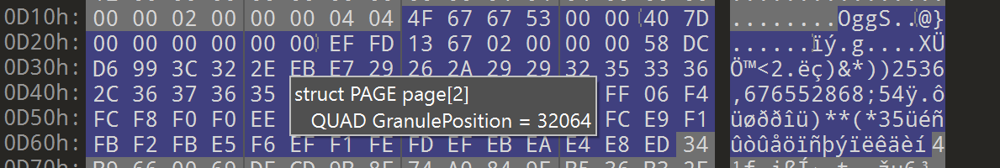

# tss-audio-data
Reverse engineering the .AUDIO_DATA files for Lego Star Wars The Skywalker Saga. Information so far based on OGG encoded files only.

This README assumes a passing familiarity with the OGG spec.

[Here's this info in action, replacing a Bib Fortuna voice line.](https://youtu.be/uS7JjUNHu5I)

## FMT Header
```c
       00 01 02 03 04 05 06 07 08 09 0A 0B 0C 0D 0E 0F  0123456789ABCDEF
0000h: 46 4D 54 20 14 00 00 00 00 00 01 00 00 7D 00 00  FMT .........}.. 
0010h: B0 B0 00 00 01 20 00 00 78 24 03 00 53 45 45 4B  °°... ..x$..SEEK
```
The predominant header starts `46 4D 54 20 14` or `FMT2014` followed by `00 00 00 00 00 01 00`. Of the 130,000 audio data files, 110,000 have this header. 20,000 have `46 4D 54 20 13` and 6 have `46 4D 54 20 10`. In both of these cases, `0A` is 0.

From `0C`-`0F` is a little endian integer representing the sample rate.
Of the 130,000 audio data files, 110,000 are 32000hz. 20,000 are 24,000hz, 5,000 are 44,100hz, and 2 are 6,000hz.

From `10`-`13` is a little endian integer representing the number of samples.

`14` is the number of tracks. `15`-`17` appear to be packing against the track value.

`18`-`1B` is currently unknown. Across the files there are ten different formats, `78 24 03 00` is overwhelmingly the most common.

## SEEK Header
```c
       00 01 02 03 04 05 06 07 08 09 0A 0B 0C 0D 0E 0F  0123456789ABCDEF
0010h: B0 B0 00 00 01 20 00 00 78 24 03 00 53 45 45 4B  °°... ..x$..SEEK 
0020h: 20 00 00 00 00 00 00 00 00 00 00 00 3A 00 00 00   ...........:... 
0030h: 00 00 00 00 18 0D 00 00 40 7D 00 00 D0 2D 00 00  ........@}..Ð-.. 
0040h: 70 33 00 00 44 41 54 41 E8 73 00 00 4F 67 67 53  p3..DATAès..OggS 
```
FMT rolls directly in to the SEEK header. This header describes the pages of the forthcoming OGG file.
Immediately following `SEEK` is an integer decribing how long the seek block is. This should be the number of pages in your OGG file plus one, and then multipled by eight.

After 8 empty bytes, which are likely the zeroeth page, we get into the meat of the SEEK block, a repeating pattern of two integers. The first integer is the address at which an OGG page starts. NB: This address is in reference to the OGG data minus any SEEK/FMT/DATA headers. Thus the first page's address should always be 3A.
The second integer is a delta between the granule of the earlier page and the current page. While an OGG file stores the granules as a sum, the SEEK header stores the difference.

010 editor is helpful for this until we can get an automated tool up and running.


## DATA Header
```c
       00 01 02 03 04 05 06 07 08 09 0A 0B 0C 0D 0E 0F  0123456789ABCDEF
0040h: 70 33 00 00 44 41 54 41 E8 73 00 00 4F 67 67 53  p3..DATAès..OggS
```
This one's real simple and comes right after the end of SEEK. Simply put `DATA` and then an integer that is the length of the OGG file.

Immediately after this the OGG file begins in earnest with its header info.